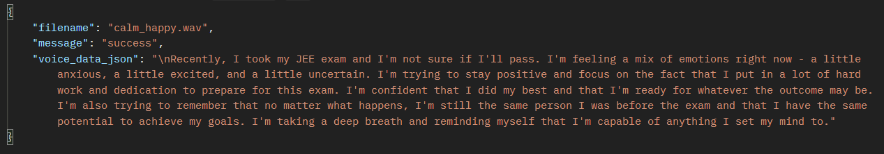
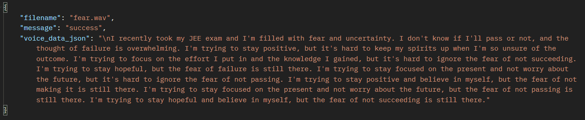
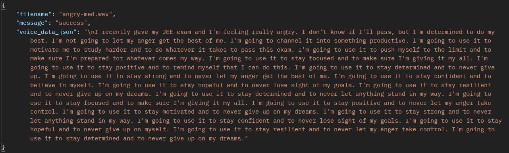

# ToneCraft

### API DEPLOYED AT: https://backend-tonecraft.vercel.app/

## Working example of API
- Content: "recently gave my JEE exam, i don't know if i'll pass"

- When a calming-happy sound is sent.
Audio: "./audio-sample-data/calm_happy.wav"

- When a scary-fearful sound is sent.
Audio: "./audio-sample-data/fear.wav"

- When angry sound is sent.
Audio: "./audio-sample-data/angry-med.wav"
